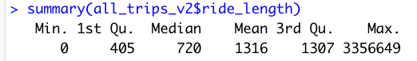
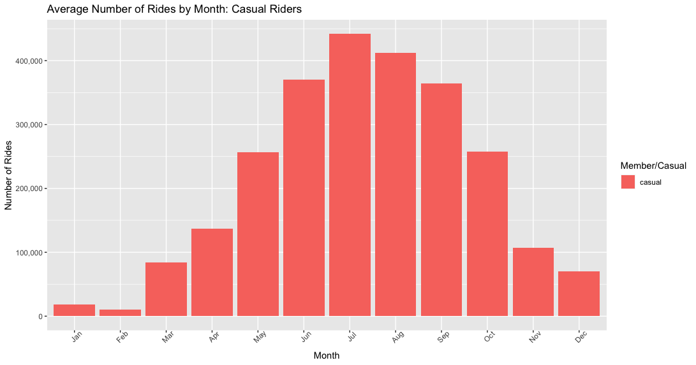

# Google Data Analytics Capstone Project Analyzed With R

## Intro

### Real-world situation

You are a junior data analyst working in the marketing analyst team at Cyclistic, a bike-share company in Chicago. The director of marketing believes the company’s future success depends on maximizing the number of annual memberships. Therefore, your team wants to understand how casual riders and annual members use Cyclistic bikes differently. From these insights, your team will design a new marketing strategy to convert casual riders into annual members. But first, Cyclistic executives must approve your recommendations, so they must be backed up with compelling data insights and visualizations.

### Business Task

 **How to get casual riders to buy Cyclistic annual memberships?**

### About the data

To analyze and identify trends, I used Cyslistic's historical trip data which can be downloaded [here](https://divvy-tripdata.s3.amazonaws.com/index.html). (Note: The datasets have a different name because Cyclistic is a fictional company. The data ahas been made available by Motivate International Inc. under this [license](https://ride.divvybikes.com/data-license-agreement)) This is public data that can be used to explore how different customer types are using Cyclistic bikes. Data is updated monthly and I used a 12 month range from January 2021 - December 2021. 

## Prerequisite

Install the required packages.

```{r}
install.packages("tidyverse")
install.packages("lubridate")
install.packages("ggplot2")
```

Once the packages are installed, it can be loaded by running the `library()` function.

```{r}
library("tidyverse") #helps to wrangle the data
library("lubridate") #easier to work with date-times
library("ggplot2") #helps visualize data
```

Additionally, use the `setwd()` function to change/set the current working directory to simplify calls to data. This will be different depending on the user.

```{r}
setwd("~/Documents/Cyclistic Trip Data/Csv")
```

## Step 1: Collect Data

At this point I want to upload the datasets that is going to be used in this analysis.

```{r}
M1_2021 <- read_csv("202101-divvy-tripdata.csv")
M2_2021 <- read_csv("202102-divvy-tripdata.csv")
M3_2021 <- read_csv("202103-divvy-tripdata.csv")
M4_2021 <- read_csv("202104-divvy-tripdata.csv")
M5_2021 <- read_csv("202105-divvy-tripdata.csv")
M6_2021 <- read_csv("202106-divvy-tripdata.csv")
M7_2021 <- read_csv("202107-divvy-tripdata.csv")
M8_2021 <- read_csv("202108-divvy-tripdata.csv")
M9_2021 <- read_csv("202109-divvy-tripdata.csv")
M10_2021 <- read_csv("202110-divvy-tripdata.csv")
M11_2021 <- read_csv("202111-divvy-tripdata.csv")
M12_2021 <- read_csv("202112-divvy-tripdata.csv")
```

## Step 2: Wrangle Data And Cominbe Into A Single File

Compare column names, using the `colnames()` function, of each of the files. They DO need to match perfectly before using the command to join them into one file.  

``` {r}
colnames(M1_2021)
colnames(M2_2021)
colnames(M3_2021)
colnames(M4_2021)
```

Use the `str()` funcition to inspect the internal structure and get a summary of the columns. Using this function we inspect and look for disparities. Again, These DO need to match before joining the files into one big data frame.

``` {r}
str(M1_2021)
str(M2_2021)
str(M3_2021)
str(M4_2021)
```

Stack all indvidual month's data frames into one big data frame. 

```{r}
all_trips <- bind_rows(M1_2021,M2_2021,M3_2021,M4_2021,M5_2021,M6_2021,M7_2021,M8_2021,M9_2021,M10_2021,M11_2021,M12_2021)
```
## STEP 3: Clean Up And Add Data To Prepare For Analysis

Inspect that the new table has been created.

```{r}
colnames(all_trips) #List of column names  
nrow(all_trips) #How many rows in the data frame
dim(all_trips)  #Dimensions of the data frame
head(all_trips) #See the first 6 rows of the data frame
tail(all_trips) #See the last 6 rows of data frame
str(all_trips)  #See list of columns and data types (numeric, character, etc.)
summary(all_trips) #Statistical summary of data. Mainly for numerics.
```

A few problems to clean. (Problem 1) The data can only be aggregated at the ride-level, which is too granular. We want to add some additional columns -- such as day, month, year -- that provide opportunities to aggregate the data. (Problem 2) Since the data does not have a 'tripduration' column, we want to add "ride_length" to the entire dataframe. (Problem 3) There are  rides where "ride_length" shows up as a negative due to the bikes being serviced. We want to delete these rides.

To fix (Problem 1) we add columns that list the date, month, day, and year of each ride. This will allow for aggregating ride data... before adding these operations we could only aggregate at the ride level.

```{r}
all_trips$date <- as.Date(all_trips$started_at) 
all_trips$month <- format(as.Date(all_trips$date), "%m")
all_trips$day <- format(as.Date(all_trips$date), "%d")
all_trips$year <- format(as.Date(all_trips$date), "%Y")
all_trips$day_of_week <- format(as.Date(all_trips$date), "%A")
```

(Problem 2) Add a "ride_length" calculation to all trips (in seconds). The `difftime()` function calculates dhte difference of two date/time objects and returns and object of class with an attribute indicating the units. Additionally, convert "ride_length" from Factor to Numberic to be able to run calculations on the data.

```{r}
all_trips$ride_length <- difftime(all_trips$ended_at,all_trips$started_at)
```

```{r}
is.factor(all_trips$ride_length)
all_trips$ride_length <- as.numeric(as.character(all_trips$ride_length))
is.numeric(all_trips$ride_length)
```

Again, make sure to inspect the structure of the columns.

```{r}
str(all_trips) 
```

In (Problem 3) we mentioned the inconsistencies due to a few hundred entries when the bikes where take out of docks to be serviced/checked for quality, causing "ride_length" to be negative. We create a new version of the data frame (v2) since data is being removed. 

```{r}
all_trips_v2 <- all_trips[!(all_trips$ride_length<0),]
```
### STEP 4: Descriptive Analysis

Descriptive analysis on ride_length (all figures are in seconds). Using the `summary()` function we can condense mean, median, max, min to one line. 

```{r}
mean(all_trips_v2$ride_length) #straight average (total ride length / rides)
median(all_trips_v2$ride_length) #midpoint number in the ascending array of ride lengths
max(all_trips_v2$ride_length) #longest ride
min(all_trips_v2$ride_length) #shortest ride
```

```{r}
summary(all_trips_v2$ride_length)
```



Now we compare members and casual users by aggregating the data.

```{r}
aggregate(all_trips_v2$ride_length ~ all_trips_v2$member_casual, FUN = mean)
aggregate(all_trips_v2$ride_length ~ all_trips_v2$member_casual, FUN = median)
aggregate(all_trips_v2$ride_length ~ all_trips_v2$member_casual, FUN = max)
aggregate(all_trips_v2$ride_length ~ all_trips_v2$member_casual, FUN = min)
```


See the average ride time by each day for members vs casual users. If you notice that the days of the week are out of order we can fix that. Note that I followed ISO 8601 for day of week order. Run `aggreagate()` again if needed to fix day of week order.

```{r}
aggregate(all_trips_v2$ride_length ~ all_trips_v2$member_casual + all_trips_v2$day_of_week, FUN = mean)
```

```{r}
all_trips_v2$day_of_week <- ordered(all_trips_v2$day_of_week, levels=c("Monday", "Tuesday", "Wednesday", "Thursday", "Friday", "Saturday", "Sunday"))
```

Analyze ridership data by type and weekday

```{r}
all_trips_v2 %>% 
  mutate(weekday = wday(started_at, label = TRUE)) %>%  #creates weekday field using wday()
  group_by(member_casual, weekday) %>%  #groups by usertype and weekday
  summarise(number_of_rides = n()                            #calculates the number of rides and average duration 
            ,average_duration = mean(ride_length)) %>%         # calculates the average duration
  arrange(member_casual, weekday)     
```

At this point I create a visualization for the average number of rider by rider type. 

```{r}
all_trips_v2 %>% 
  group_by(member_casual, day_of_week) %>% 
  summarise(number_of_rides = n(), .groups = 'drop') %>% 
  #arrange(member_casual, day_of_week) %>% 
  ggplot(aes(x = day_of_week, y = number_of_rides, fill = member_casual)) +
  geom_col(position = "dodge") + scale_y_continuous(labels = scales::comma) +
  labs(x = "Day of Week", y = "Number of Rides", fill = "Member/Casual",
       title = "Average Number of Rides by Day: Members vs. Casual Riders")
```


Adding another visualization comparing average duration of members and casual riders.

```{r}
all_trips_v2 %>% 
  group_by(member_casual, day_of_week) %>% 
  summarise(average_duration = mean(ride_length), .groups = 'drop') %>% 
  #arrange(member_casual, day_of_week) %>% 
  ggplot(aes(x = day_of_week, y = average_duration, fill = member_casual)) +
  geom_col(position = "dodge") +
  labs(x = "Day of Week", y = "Average Duration (min)", 
       fill = "Member/Casual",
       title = "Average Riding Duration by Day: Members vs. Casual Riders")
```


Separate graphs visualizing average number of rides by month. 

```{r}
all_trips_v2 %>% 
  group_by(month, member_casual) %>% 
  summarize(number_of_rides = n(), .groups = 'drop') %>% 
  filter(member_casual == 'casual') %>%
  drop_na() %>%
  ggplot(aes(x = month.abb, y = number_of_rides, fill = member_casual)) + 
  geom_bar(position = 'dodge', stat = 'identity') + scale_y_continuous(labels = scales::comma) + scale_x_discrete(limits=month.abb) +
  theme(axis.text.x = element_text(angle = 45)) + 
  labs(x = "Month", y = "Number of Rides", 
       fill = "Member/Casual",
       title = "Average Number of Rides by Month: Casual Riders")
```

```{r}
all_trips_v2 %>% 
  group_by(month, member_casual) %>% 
  summarize(number_of_rides = n(), .groups = 'drop') %>% 
  filter(member_casual == 'member') %>%
  drop_na() %>%
  ggplot(aes(x = month.abb, y = number_of_rides, fill = member_casual)) + 
  geom_bar(position = 'dodge', stat = 'identity') + scale_y_continuous(labels = scales::comma) + scale_x_discrete(limits=month.abb) +
  theme(axis.text.x = element_text(angle = 45)) + 
  labs(x = "Month", y = "Number of Rides", 
       fill = "Member/Casual",
       title = "Average Number of Rides by Month: Member Riders")
```




## Observations

## Wrap Up

There is a lot of data that can be used here. Other software tools like Excel, Tableau, SQL can also aid in the data analysis process.
